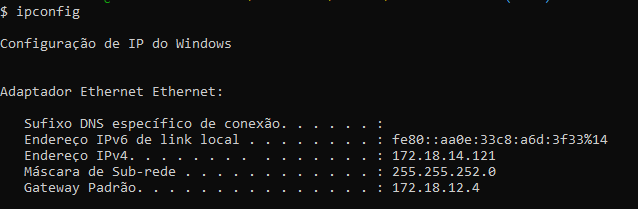
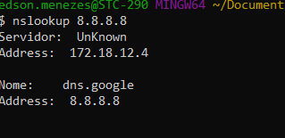

# comandos de rede que todo profissional de TI precisa conhecer

ping (Windows e Linux)
#### comando ping: ping é um utilitário que usa o protocolo ICMP para testar a conectividade entre equipamentos.

##### ping 8.8.8.8

tracert (Windows, no Linux é traceroute)
#### comando tracert: traceroute é uma ferramenta de diagnóstico que rastreia a rota de um pacote através de uma rede de computadores que utiliza os protocolos IP e o ICMP.

#### tracert 

#### tracert 1.1.1.1

pathping (Windows e no Linux é mtr)
#### O comando pathping é uma ferramenta de rastreamento de rota do WIndows que combina os recursos dos comandos ping e tracert.

#### pathping

#### pathping 1.1.1.1 -n

netstat (Windows e Linux)
#### netstat: é uma ferramenta utilitária de rede de linha de comando que exibe conexões de rede para o Transmission Control Protocol e User Datagram Protocol, tabelas de roteamento e várias interfaces de rede e estatísticas de protocolo de rede.

hostname (Windows e Linux)
#### hostname: host é um rótulo atribuído a um dispositivo conectado a uma rede de computadores e usado para identificar o dispositivo.
#### hostname

arp (Windows e Linux)
#### arp: Protocolo de Resolução de Endereços é um padrão da telecomunicação.

#### arp -a

ipconfig (Windows, no Linux é ifconfig)
#### ipconfig: é um programa do sistema operacional Microsoft Windows capaz de dar informações sobre o IP da rede local.
#### ipconfig 

#### ipconfig /all

nbtstat (Windows)
#### nbtstat: permite uma atualização do cache de nomes NetBIOS e dos nomes registrados com o serviço de cadastramento na Internet do Windows (WINS).
#### nbtstat

#### nbtstat -c

nslookup (Windows e Linux)
#### nslookup:nslookup é uma ferramenta comum ao Windows e ao Linux e utilizada para se obter informações sobre registros de DNS de um determinado domínio.

route (Windows e Linux)
#### route:resolve todos os nomes simbólicos em endereços, usando o arquivo /etc/hosts ou o servidor de nome de rede.

systeminfo / lspci (windows linux)
#### systeminfo: Esta ferramenta exibe informações de configuração de sistema para.

